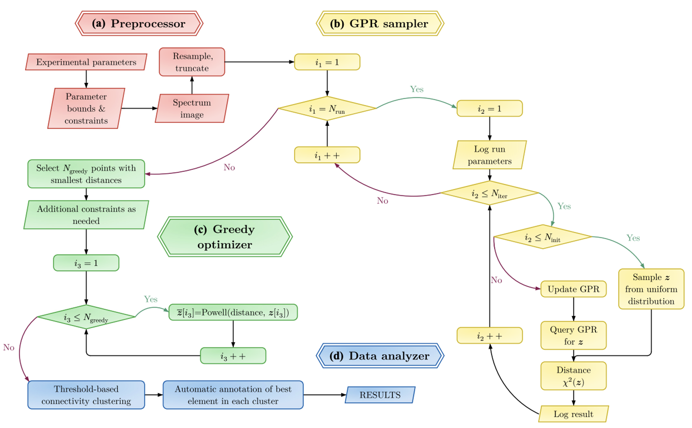

# Current status of Hamiltonian inference

Our recent [paper](https://markdean.info/assets/pdf/lajer2025hamiltonian.pdf) is useful for understanding where we are. See Ref. [^1] for the original paper and Ref. [^2] for the source code.  

## Summary of what we implemented

* Atomic model for RIXS (similar to that shown previously).

* Incident-energy vs. energy-loss planes for specific geometry and incident x-ray polarization. This is the data for Fe2O3:[^3]

* Mixture of Bayesian and a greedy optimizer [PyBOBYQA](https://numericalalgorithmsgroup.github.io/pybobyqa/build/html/index.html) for the solver

## Performance 

* We did 60 runs of 1000 iterations corresponding to running overnight on a personal computer.
* Obtained solutions similar to a human.
* Super-human error analysis.
 
[^1]: Hamiltonian parameter inference from resonant inelastic x-ray scattering with active learning, Marton K. Lajer, Xin Dai, Kipton Barros, Matthew R. Carbone, S. Johnston, and M. P. M. Dean, 
[Phys. Rev. B 112, 155167 (2025)](https://doi.org/10.1103/tnqm-ttj3)

[^2]: [EDRIXS inverse solver](https://github.com/EDRIXS/Inverse_scattering_solver)

[^3]: Single- and Multimagnon Dynamics in Antiferromagnetic 𝛼−Fe2O3 Thin Films,  J. Li, Y. Gu, Y. Takahashi, K. Higashi, T. Kim, Y. Cheng, F.
Yang, J. Kuneš, J. Pelliciari, A. Hariki, and V. Bisogni, [Phys. Rev. X 13, 011012 (2023)](https://doi.org/10.1103/PhysRevX.13.011012)
